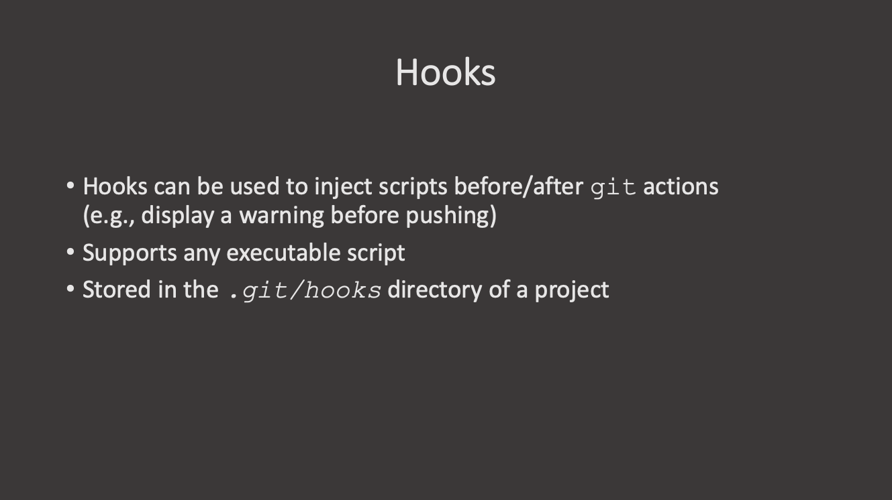

:::::::::::::::::::::::::::::::::::::::: questions

- How do I automate checks on my commit?
- How do I check changes before a commit?

::::::::::::::::::::::::::::::::::::::::::::::::::

::::::::::::::::::::::::::::::::::::::: objectives

- Learn about using hooks to improve quality of commits

::::::::::::::::::::::::::::::::::::::::::::::::::

Git hooks are scripts that get run when a specific event occurs in git. The scripts can be written in any language and do anything you like, so any executable script can be a hook.

Git hooks can trigger events on the server side or locally, and commonly used hooks include:
- `pre-commit`: Executed before the `git commit` command and is usually used to
  check the changes with linters or tests.
- `prepare-commit-msg`: Executed before after the commit message is created, but before the commit message editor is started. Good for changing the default commit message programmatically before the user sees it.
- `commit-msg`: Validates the commit message, can be used to check whether the
  commit message adheres to project policies
- `post-commit`: Runs after the commit, often used for notifications or
  logging.
- `pre-receive`: Server-side hook, which runs before a push is accepted,
  commonly used to enforce project policies

Examples of local events that can trigger hooks include `commit` (pre- or post-commit hooks), `checkout` or `rebase`. Pre-commit hooks are perhaps the most common and useful ones: they trigger actions before the code is committed and if the hook script fails, then the command is aborted. This can be very powerful - you can automatically run linters, before the code is even committed.

List of pre-written pre-commit hooks: https://github.com/pre-commit/pre-commit-hooks

The executable files are stored in the `.git/hooks/` directory in your project directory. A pre-commit hooks will be an executable file in this directory stored with the magic name `pre-commit`. Check the directory, there are already several examples.

Before creating the hook, make sure `flake8` is installed in your environment:

```bash
pip install flake8
```

Now, let's create the hook:

```bash
touch .git/hooks/pre-commit
nano .git/hooks/pre-commit
```

And add the following text to it:

~~~
#!/usr/bin/env bash

set -eo pipefail
flake8 hello.py
echo "flake8 passed!"
~~~

Now let's make `hello.py`:

```bash
touch hello.py
nano hello.py
```

Make the hook file executable, otherwise Git will silently ignore it:

```bash
chmod +x .git/hooks/pre-commit
```

And add some text to it:

```python
print('Hello world!'')
```

The typo is on purpose. Add and commit it to the repository.

:::::::::::::::::::::::::::::::::::::::  challenge

## Challenge 1: Enforcing commit message format with a hook

Create a file called `commit-msg` within the directory `.git/hooks/`. It must
be able to determine if the commit message is prefixed by `feat:`, `fix:`, or `docs:`; otherwise, it will prevent the commit from being made and provide feedback. Run `chmod` on the file to make it executable. To test, initially do an attempt at committing using an invalid message like "updated stuff" and see that it will fail. Then commit again using a valid commit message such as
"feat: add new recipe" and verify that it succeeds.

::: hint

The `commit-msg` hook receives the path to a temporary file containing the
commit message as its first argument. Inside the script, you can access it
with `$1`. To read the contents of that file: `cat "$1"`
:::

::: hint

You can use `grep` with regex to check the message format. For example:

```bash
grep -qE "^(feat|fix|docs):"
```

`-q` runs grep quietly (no output), `-E` enables extended regex, and
`^(feat|fix|docs):` matches lines that start with one of these three words
followed by a colon.

In a hook script, if a command exits with a non-zero status, the commit is
aborted. So `exit 1` rejects the commit.
:::

:::::::::::::::  solution

```bash
nano .git/hooks/commit-msg
```

```bash
commit_msg=$(cat "$1")

if ! echo "$commit_msg" | grep -qE "^(feat|fix|docs):"; then
    echo "ERROR: Commit message must start with 'feat:', 'fix:' or 'docs:'"
    exit 1
fi
```

```bash
chmod +x .git/hooks/commit-msg
```

```bash
git commit -m "updated stuff"
```
```output
ERROR: Commit message must start with 'feat:', 'fix:' or 'docs:'
```

```bash
git commit -m "feat: add test file"
```
```output
[main <hash>] feat: add test file
```
:::::::::::::::::::::::::

::::::::::::::::::::::::::::::::::::::::::::::::::

GitHub actions are the equivalent of server-side hooks on GitHub.

There are lots of things that can be done with GitHub actions: https://docs.github.com/en/actions

Here is an example of a simple cron job: https://github.com/mpi-astronomy/XarXiv




Materials: https://verdantfox.com/blog/how-to-use-git-pre-commit-hooks-the-hard-way-and-the-easy-way

:::::::::::::::::::::::::::::::::::::::: keypoints

- Git provides a list of different hooks for you to run tasks at specific times
  in the commit
- Use the `pre-commit` hook to check for change conformity before changes are
  committed

::::::::::::::::::::::::::::::::::::::::::::::::::

