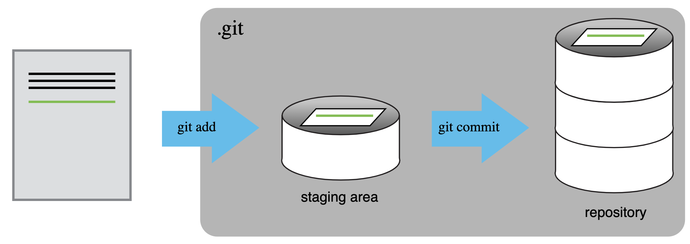
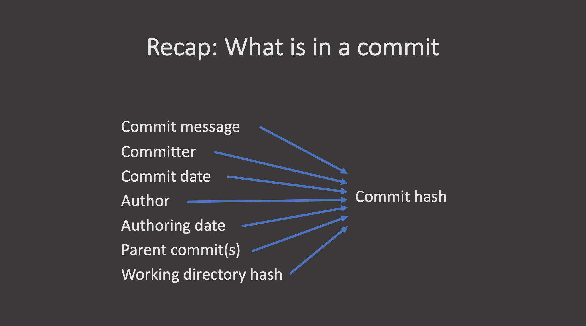
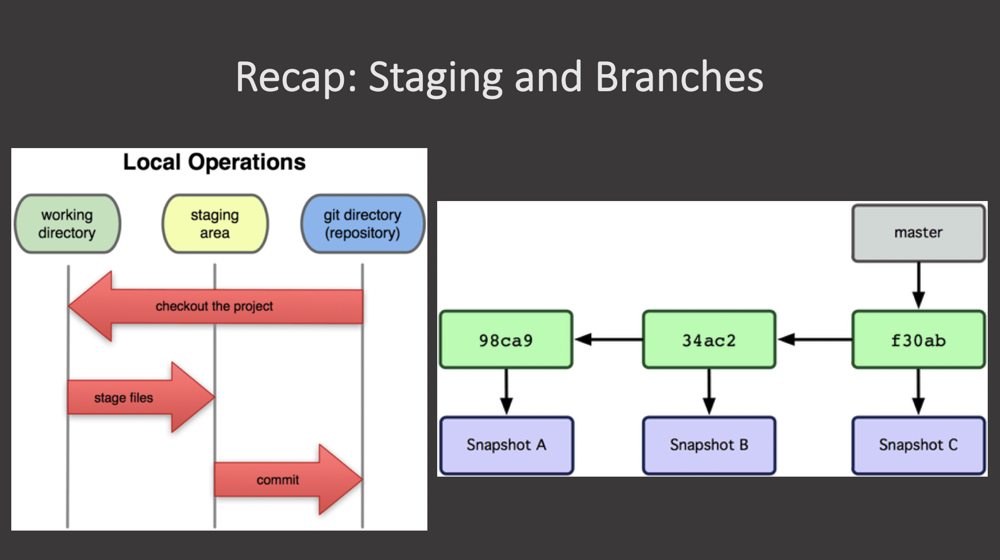

::::::::::::::::::::::::::::::::::::::: objectives

- Understand the range of functionality that exists in git.
- Understand the different challenges that arise with collaborative projects.

::::::::::::::::::::::::::::::::::::::::::::::::::

:::::::::::::::::::::::::::::::::::::::: questions

- What do I do when I need to make complex decisions with my git repository?
- How do I collaborate on a software project with others?

::::::::::::::::::::::::::::::::::::::::::::::::::

## Introduction

Version control systems are a way to keep track of changes in text-based documents.
We start with a base version of the document and then record the changes you make each step of the way.
You can think of it as a recording of your progress: you can rewind to start at the base document and play back each change you made, eventually arriving at your more recent version.

The git version control system, used to manage the code in many millions of software projects, is one of the most widely adopted one.
It uses a distributed version control model (the "beautiful graph theory tree model"), meaning that there is no single central repository of code.
Instead, users share code back and forth to synchronize their repositories, and it is up to each project to define processes and procedures for managing the flow of changes into a stable software product.

## Challenges

Git is powerful and flexible to fit a wide range of use cases and workflows from simple projects written by a single contributor to projects that are millions of lines and have hundreds of co-authors.
Furthermore, it does a task that is quite complex. As a result, many users may find it challenging to navigate this complexity.
While committing and sharing changes is fairly straightforward, recovering from situations such as accidental commits, pushes or bad merges is difficult without a solid understanding of the rather large and complex conceptual model.
Case in point, three of the top five highest voted questions on Stack Overflow are questions about how to carry out relatively simple tasks: undoing the last commit, changing the last commit message, and deleting a remote branch.

[{alt="An XKCD comic about the git control system."}](https://xkcd.com/1597/)

*Mouse-over text: If that doesn't fix it, git.txt contains the phone number of a friend of mine who understands git. Just wait through a few minutes of 'It's really pretty simple, just think of branches as...' and eventually you'll learn the commands that will fix everything.*

With this lesson our goal is to give a you a more in-depth understanding of the conceptual model of git, to guide you through increasingly complex workflows and to give you the confidence to participate in larger projects.

## Quick Review

Let's take a moment to review some of the basic git commands.

### Initializing a Repository

```bash
git init
```
git init creates a new git repository in the current directory.
Specifically, this means creating a subdirectory named `.git` that contains your repository's metadata and object database.
Generally speaking, we don't tinker with this directory, but it's useful to know that it exists and that is is the marker of a folder on our computer being a git repository.

### The Git Workflow

git has a three-stage workflow: the working directory, the staging area, and the repository.
When we make changes to files in our working directory, they are not included in the next commit until we stage them, which is done by adding them to the staging area.
The staging area allows us to prepare a snapshot of the changes before committing them to the repository.
Once we are satisfied with the changes in the staging area, we can commit them to the repository, which records the changes and creates a new commit object.

{alt="A diagram showing the relationship between the working directory, staging area, and repository in git."}

```bash
git add file.txt
git commit -m "Message"
```

A commit, or "revision", is an individual change to a file or set of files.
It's like when you save a file, except with `git`, every time you save it creates a unique ID (a.k.a. the "SHA" or "hash") that allows you to keep record of what changes were made when and by who.
Each commit contains several key pieces of information that uniquely define its state:

- **Commit message**: A description provided by the user explaining the purpose or details of the commit.

- **Committer**: The person who added the commit to the repository.

- **Commit date**: The date and time when the commit was added to the repository.

- **Author**: The original creator of the changes in the commit, which may differ from the committer.

- **Authoring date**: The date and time when the changes were originally made by the author.

- **Parent commit(s)**: Reference to the previous commit(s), which allows Git to trace the history and create a chain of commits.

- **Working directory hash**: A unique hash representing the state of all tracked files in the working directory at the time of the commit.

{alt="A diagram showing the components that make up a git commit."}

All these elements together generate a unique **commit hash**, which identifies the commit across the Git repository.

### Exploring the Repository

We can move around the repository and explore its history using the following commands:

- `git log`: Shows the commit history for the current branch, displaying commit hashes, authors, dates, and messages.
- `git status`: Displays the current state of the working directory and staging area, indicating which files are modified, staged, or untracked.
- `git diff`: Shows the differences between the working directory and the staging area, or between commits, allowing you to see what changes have been made.
- `git checkout HEAD file.txt`: Reverts the specified file in the working directory to the state of the last commit, discarding any changes made since then.

### Interacting with Remote Repositories

To collaborate with others, we often work with remote repositories.

- `git clone http://....`: Creates a local copy of a remote repository, allowing you to work on it locally.
- `git push`: Uploads your local commits to a remote repository, sharing your changes with others.
- `git pull`: Fetches and integrates changes from a remote repository into your local branch, keeping your local copy up to date.
- `git fetch`: Downloads commits, files, and refs from a remote repository into your local repository without merging them into your current branch.


::: callout

You can consider git fetch the 'safe' version of the two commands.
It will download the remote content but not update your local repository's working state, leaving your current work intact.
`git pull` is the more aggressive alternative; it will download the remote content for the active local branch and immediately execute `git merge` to create a merge commit for the new remote content.
If you have pending changes in progress this will cause conflicts and kick-off the merge conflict resolution flow.

:::

It is sometimes useful to only pull the changes from a certain branch, e.g., `main`.
For a repository that has a lot of contributors and branches, all the changes may be unnecessary and overwhelming:

```bash
git fetch origin main
```

https://www.atlassian.com/git/tutorials/syncing/git-fetch

{alt ="A diagram showing alternate diagrams for understanding the working directory, staging area, and repository in git, as well as commits on a branch."}

:::::::::::::::::::::::::::::::::::::::: keypoints

- Git version control records text-based differences between files.
- Each git commit records a change relative to the previous state of the documents.
- Git has a range of functionality that allows users to manage the changes they make.
- This complex functionality is especially useful when collaborating on projects with others

::::::::::::::::::::::::::::::::::::::::::::::::::
