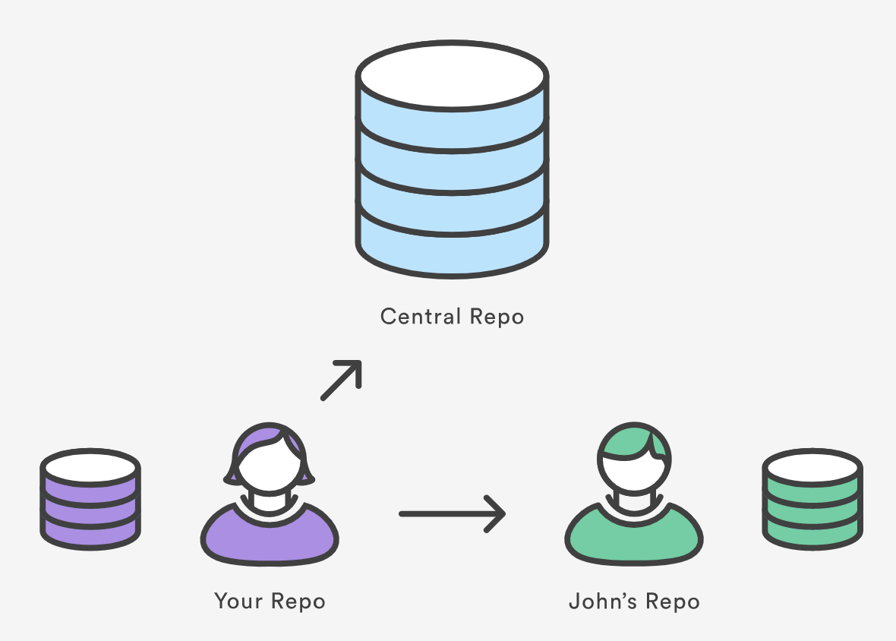

::::::::::::::::::::::::::::::::::::::: objectives

- Learn about remote repositories.

::::::::::::::::::::::::::::::::::::::::::::::::::

:::::::::::::::::::::::::::::::::::::::: questions

- How do I connect my code to other versions of the it?

::::::::::::::::::::::::::::::::::::::::::::::::::

## What is a Remote Repository?

Remote repositories are versions of your project that are hosted somewhere else, typically on the Internet.
Common examples of remote repositories are GitHub, GitLab, and Bitbucket.
Remote repositories can be used to collaborate with other developers, or to simply back up your work.

::: callout

Though remote repositories are typically hosted on the Internet, they can also be hosted on a local network or even on the same machine as your local repository.
The key is that they are separate from your local repository and can be accessed over a network.

:::

::: instructor

https://www.atlassian.com/git/tutorials/syncing

Git's distributed collaboration model, which gives every developer their own copy of the repository, complete with its own local history and branch structure. Users typically need to share a series of commits rather than a single "changeset". Instead of committing a "changeset" from a working copy to the central repository, Git lets you share entire branches between repositories.

:::

## git remote

The `git remote` command lets you create, view, and delete connections to other repositories.
You can think of remote connections as more like bookmarks, rather than a direct connection to the remote repository.
Instead of providing real-time access to another repository, they serve as convenient names that can be used to reference a not-so-convenient URL.

::: callout

Typically, the first remote connection you create is called `origin`.
This is a convention that is used by most Git-based projects.
The `origin` remote is usually the central repository that you cloned your local repository from, or the central repository that you will be pushing your changes to.

:::

{alt="A diagram showing a local git repository with remote connections to two other repositories."}

For example, the diagram above shows two remote connections from your repo into the central repo and another developer's repo.
Every time we wanted to reference these remote repositories, we could use the full URLs, however it is far more convenient to use a shorthand label.
Instead of referencing them by their full URLs, you can pass the "origin" and "john" shortcuts to other Git commands.

::: callout

The `git remote` command is essentially an interface for managing a list of remote entries that are stored in the repository's `./.git/config` file. The following commands are used to view the current state of the remote list.

:::

Git is designed to give each developer an entirely isolated development environment.
This means that information is not automatically passed back and forth between repositories.
Instead, developers need to manually pull upstream commits into their local repository or manually push their local commits back up to the central repository.
The `git remote` command is really just an easier way to pass URLs to these "sharing" commands.

::: prereq

We will need a remote repository to connect to at this point.
You will need to have an account on a Git hosting service (GitHub, GitLab, Bitbucket, etc.) and have completed the steps to authenticate your local git installation with that service.

:::

## Creating a Remote Repository

Using the service of your choosing, create a new repository.
The exact steps for this will depend on the exact service that you are using.

In general, look for a button or link, typically at the top of the page, that says "New Repository" or "Create Repository".
You will need to provide a name for your repository, and given the opportunity to add a description and apply various settings or options.
For the purposes of this workshop, create a repository called `recipes`.

::: caution

!! Make sure you do not initialize the remote repository with a README file or any other files. !!

We already have a repository locally that contains commits that we have made up to this point.
If you create a new remote repository and initialize it with a README file, then the remote repository will have an initial commit that does not exist in our local repository.
This will cause problems when we try to push our local commits to the remote repository.

:::

## Adding a Remote Repository

Now, we need to connect our local repository to that remote repository. The command for this is `git remote add`:

```bash
git remote add origin <REPOSITORY-URL>
```

::: callout

You can find the repository URL on the main page of your remote repository. It should look something like `https://gitlab.com/username/repository-name.git`. The location of this URL will depend on the hosting service you are using (GitLab, GitHub, Bitbucket, etc.).

::: tab

### Gitlab

Look for the blue "Code" button on the upper right of the repository page. Click it to reveal the URL.

### GitHub

Look for the green "Code" button on the upper right of the repository page. Click it to see two tabs: "Local" and "Codespaces". Under the "Local" tab, you will find the URL.

:::

Most hosting services will provide the URL in two forms: HTTPS and SSH. If you are unsure which one to use, choose HTTPS.

SSH requires additional setup which we do not cover in this training.
You can find a guide for setting up SSH on GitHub in [the "Git Novice" workshop material](https://swcarpentry.github.io/git-novice/07-github.html#ssh-background-and-setup).
:::

## View Remote Configuration

To list the remote connections of your repository to other repositories you can use the `git remote` command:

```bash
git remote
```

If you test this in our training repository, you should get only one connection, `origin`:
```bash
origin
```

::: callout

When you clone a repository with `git clone`, `git` automatically creates a remote connection called `origin` pointing back to the cloned repository.
This is useful for developers creating a local copy of a central repository, since it provides an easy way to pull upstream changes or publish local commits.
This behaviour is also why most Git-based projects call their central repository origin.

:::

We can ask `git` for a more verbose (`-v`) answer which gives us the URLs for the connections:

```bash
git remote -v
```

## Syncing with Remote Repositories

So we have a remote connection, but how do we make the code in our local repository match the code in the remote repository? There are three commands that we use to sync code between repositories: `git fetch`, `git pull`, and `git push`.

- `fetch` - Downloads commits, files, and refs, but does not modify your working directory. This gives you a chance to review changes before integrating them into your local repository.
- `pull` - Downloads commits, files, and refs, and immediately merges them into your local branch. This is a convenient way to integrate changes from a remote repository into your local repository in one step.
- `push` - Uploads your local commits to a remote repository. This is how you share your changes with other developers.

At the moment, our remote repository is empty, so we need to "push" our local commits to the remote repository.
We can do this with the `git push` command:

```bash
git push
```

```output
$ git push
Enumerating objects: 29, done.
Counting objects: 100% (29/29), done.
Delta compression using up to 12 threads
Compressing objects: 100% (22/22), done.
Writing objects: 100% (29/29), 2.61 KiB | 534.00 KiB/s, done.
Total 29 (delta 5), reused 0 (delta 0), pack-reused 0 (from 0)
remote: Resolving deltas: 100% (5/5), done.
To https://github.com/<username>/recipes.git
 * [new branch]      main -> main
branch 'main' set up to track 'origin/main'.
```

If you now go back to the repository and refresh the page, you should see your commits there!

Feel free to explore the remote repository a bit.
You should be able to use the web interface to view the individual files, view the commit history, and even edit files directly in the browser.

There's one thing missing though - the `yaml-format` branch that we made in the previous episode isn't on the remote repository.
Why?
When we pushed our local commits to the remote repository, we only pushed the `main` branch.
You can see this specifically in the output of the `git push` command above, where it says `* [new branch]      main -> main`.
Git is being a little cautious here, and will not push branches that don't exist on the remote repository unless we explicitly tell it to do so.

Let's push the `yaml-format` branch to the remote repository:

```bash
git switch yaml-format
git push
```

::: callout

Depending on the version of git you are using, you may get an error message that says something like:

```output
fatal: The current branch yaml-format has no upstream branch.
To push the current branch and set the remote as upstream, use

    git push --set-upstream origin yaml-format
```

git is saying that the current branch doesn't have any information about where it should be pushed to in the remote repository.
We can fix this by using the `--set-upstream` option to tell git where to push the current branch as indicated in the error message.

:::

::: callout

The majority of the time, there is no reason why the branch on the remote repository should have a different name than the branch in your local repository.
If you want git to always create a corresponding branch on the remote repository with the same name as your local branch, you can set the `push.autoSetupRemote` configuration option to `true`:

```bash
git config --global push.autoSetupRemote true
```

:::

::: callout

### Did you get an error about "unrelated histories"?

```output
fatal: refusing to merge unrelated histories
```

Why? When we created our remote repository, we initialized it with a README file. This created an initial commit in the remote repository that doesn't exist in our local repository. Git sees that the commits in our local repository and the single commit in the remote don't seem to be from the same tree, and so it refuses to merge them. To fix this, we can use the `--allow-unrelated-histories` flag to tell
git to go ahead and merge the two histories:

```bash
git pull --allow-unrelated-histories
```

You should be asked to provide a merge commit message. Save and close the editor to complete the merge.

```output
$ git pull --allow-unrelated-histories
Merge made by the 'ort' strategy.
 README.md | 93 +++++++++++++++++++++++++++++++++++++++++++++++++++++++++++++++
 1 file changed, 93 insertions(+)
 create mode 100644 README.md
```

So that pulled a README.md file from the remote repository and merged it into our local repository. If we look at the log, we can see that we now have two commits: our original commit and a merge commit that brings in the changes from the remote repository.

```bash
git log --oneline
```

```output
$ git log --oneline
0622c3a (HEAD -> main) Merge branch 'main' of https://gitlab.git.nrw/hartman/git-workshop
5be9f46 (origin/main) Initial commit
68b09d0 (yaml-format) Rename recipe file to use .yaml extension.
a2b55be Reformat recipe to use YAML.
```

Note here that the log command also tells us about the locations of the pointers for each branch. We can see that our local `main` branch (HEAD -> main) is now at the merge commit, and the `origin/main` branch is at the initial commit from the remote repository. We can also see that our `yaml-format` branch is still at the commit where we renamed the recipe file.

:::

## Viewing Remote Information

To see more detailed information about a specific remote connection, you can use the `git remote show` command followed by the name of the remote. For example, to see information about the `origin` remote, you would run:

```bash
git remote show origin
```

```output
$ git remote show origin
* remote origin
  Fetch URL: <REPOSITORY-URL>
  Push  URL: <REPOSITORY-URL>
  HEAD branch: main
  Remote branches:
    main        tracked
    yaml-format tracked
  Local branches configured for 'git pull':
    main        merges with remote main
    yaml-format merges with remote yaml-format
  Local refs configured for 'git push':
    main        pushes to main        (up to date)
    yaml-format pushes to yaml-format (up to date)
```

::: callout

It's possible to have more than one remote for a given repository. You can add additional remotes with `git remote add <name> <url>`, and then view them with `git remote -v` or `git remote show <name>`.

This might be used if, for instance, you have a central repository that you store your projects in, but also another repository that you use for backup purposes. You could have remotes called `origin` and `backup`, each pointing to different URLs.

:::

## Pushing to Remote Repositories

Let's make a change to our local repository and then push that change to the remote repository.
Switch back to the main branch and let's edit the `guacamole.md` file.

```bash
git switch main
nano guacamole.md
```

Add the following line to the end of the file:

```
* squeeze the juice of the lime into the bowl.
```

add and commit the change:

```bash
git add guacamole.md
git commit -m "Extend guacamole recipe to include lime juice."
```

now let's run `git status` to see what the state of our local repository is:

```output
$ git status
On branch main
Your branch is ahead of 'origin/main' by 1 commit.
  (use "git push" to publish your local commits)

Untracked files:
  (use "git add <file>..." to include in what will be committed)
        recipes/

nothing added to commit but untracked files present (use "git add" to track)
```

In addition to letting us know that we have untracked files, git is also telling us that our local branch is ahead of the remote branch by 1 commit.

::: callout

Remember that the remote is just a bookmark! Even though we made a commit, that commit only exists in our local repository.
Likewise, if someone else made a commit to the remote repository, our local repository would not know about it until we fetched the changes from the remote repository.

:::


Let's use the `git push` command to upload our local commits to the remote repository:

```bash
git push
```

```output
$ git push
Enumerating objects: 5, done.
Counting objects: 100% (5/5), done.
Delta compression using up to 12 threads
Compressing objects: 100% (3/3), done.
Writing objects: 100% (3/3), 347 bytes | 347.00 KiB/s, done.
Total 3 (delta 2), reused 0 (delta 0), pack-reused 0 (from 0)
remote: Resolving deltas: 100% (2/2), completed with 2 local objects.
To <REPOSITORY-URL>
   be7b91a..9b365ec  main -> main

```

If we now refresh the page on Gitlab, we should see our commits there!

::: instructor

## Create and Modify Connections

The `git remote` command also lets you manage connections with other repositories. The following commands will modify the repo's `./.git/config` file. The result of the following commands can also be achieved by directly editing the `./.git/config` file with a text editor.

Create a new connection to a remote repository. After adding a remote, you'll be able to use `＜name＞` as a convenient shortcut for `＜url＞` in other Git commands.

```bash
git remote add <name> <url>
```


Remove the connection:

```bash
git remote rm <name>
```

Rename a connection:
```bash
git remote rename <old-name> <new-name>
```

To get high-level information about the remote `＜name＞`:
```bash
git show <name>
```

Exercise: Add a connection to your neighbour's repository. Having this kind of access to individual developers' repositories makes it possible to collaborate outside of the central repository. This can be very useful for small teams working on a large project.

```bash
git remote add john http://dev.example.com/john.git
```


## Starting a branch from the main repository state:

Remember that when you create a new branch without specifying a starting point, then the starting point will be the current state and branch. In order to avoid confusion, ALWAYS branch from the stable version. Here is how you would branch from your own origin/main branch:

```bash
git fetch origin main
git checkout -b <branch> origin/main
```

You must fetch first so that you have the most recent state of the repository.

If there is another "true" version/state of the project, then this connection may be set as upstream (or something else). `Upstream` is a common name for the stable repository, then the sequence will be:

```bash
git fetch upstream main
git checkout -b <branch> upstream/main
```

Now we can set the MPIA version of our repository as the upstream for our local copy.

:::::::::::::::::::::::::::::::::::::::  challenge

## Setting the upstream repository

Set the https://github.com/mpi-astronomy/advanced-git-training as the upstream locally.

Then, examine the state of your repository with `git branch`, `git remote -v`, `git remote show upstream`

:::::::::::::::  solution

```bash
git remote add upstream https://github.com/mpi-astronomy/advanced-git-training.git
git fetch upstream
git checkout -b develop upstream/develop
```

:::::::::::::::::::::::::

::::::::::::::::::::::::::::::::::::::::::::::::::

:::


:::::::::::::::::::::::::::::::::::::::  challenge

## Creating a branch and pushing it to the remote

Create a new branch in our local repository called `bean-dip` and add the following recipe in a file called `bean-dip.md`:

```
# Bean Dip
## Ingredients
- beans
## Instructions
```

Add and commit the new file, then push the new branch to the remote repository with `git push`. What happens? Can you find the branch on the remote?

:::::::::::::::  solution

```bash
git branch bean-dip
git switch bean-dip
nano bean-dip.md
git add bean-dip.md
git commit -m "Add bean dip recipe."
git push
```

What happens here can depend on the version of git you are using. In more recent versions, git will automatically create the remote branch when you push a local branch that doesn't exist on the remote. In older versions, you may need to specify the remote and branch name explicitly:

```bash
git push --set-upstream origin bean-dip
```

:::::::::::::::::::::::::

::::::::::::::::::::::::::::::::::::::::::::::::::

:::::::::::::::::::::::::::::::::::::::  challenge

## Fetching Remote Changes

We've heard that it's a great idea to put information about our repository in the README file.
Using the Web IDE of your remote repository, create a new file called "README.md" and add content like the following:

```markdown
# Recipes Repository

This repository contains a collection of recipes that I have collected over the years.
We are using git to manage and collaborate on these recipes.
```

1. Now back in our local git repo, instead of running `git pull`, run `git fetch`.
2. Next, run `git log --oneline --all` and pay attention to the branch pointers after each commit.
3. Run `cat README.md`. What happens? Why?
4. This time run `git pull` and then run `cat README.md` again. What happens now?

How does `git fetch` differ from `git pull` based on what you observed?

::: hint

Branches that start with `origin/` are remote tracking branches.

:::

:::::::::::::::  solution

When you run `git log --oneline --all`, you should see that we can see the new commit from the remote repository, but our local branch pointer is still at the previous commit. This is because `git fetch` only downloads the commits from the remote repository, but does not update our local branches.
Our local repository is still at the previous commit, as indicated by the `HEAD -> main` pointer.

```bash
$ git log --oneline --all
fee8d0c (origin/main, origin/HEAD) Add initial README with repository information
9b365ec (HEAD -> main) extend guacamole recipe to include lime juice.
```


When we run `cat README.md`, we are told that no such file exists.
This is because the file is only present on the remote. We have pulled down the information about the new commit, but we have not yet updated our local branch.

When we run `git pull`, git will fetch the commits from the remote repository and then merge them into our local branch.
After running `git pull`, if we run `cat README.md`, we should see the contents of the README file that we created in the remote repository.

:::::::::::::::::::::::::


::::::::::::::::::::::::::::::::::::::::::::::::::

:::::::::::::::::::::::::::::::::::::::: keypoints

- The `git remote` command allows us to create, view and delete connections to other repositories.
- Remote connections are like bookmarks to other repositories.
- Other git commands (`git fetch`, `git push`, `git pull`) use these bookmarks to carry out their syncing responsibilities.

::::::::::::::::::::::::::::::::::::::::::::::::::
